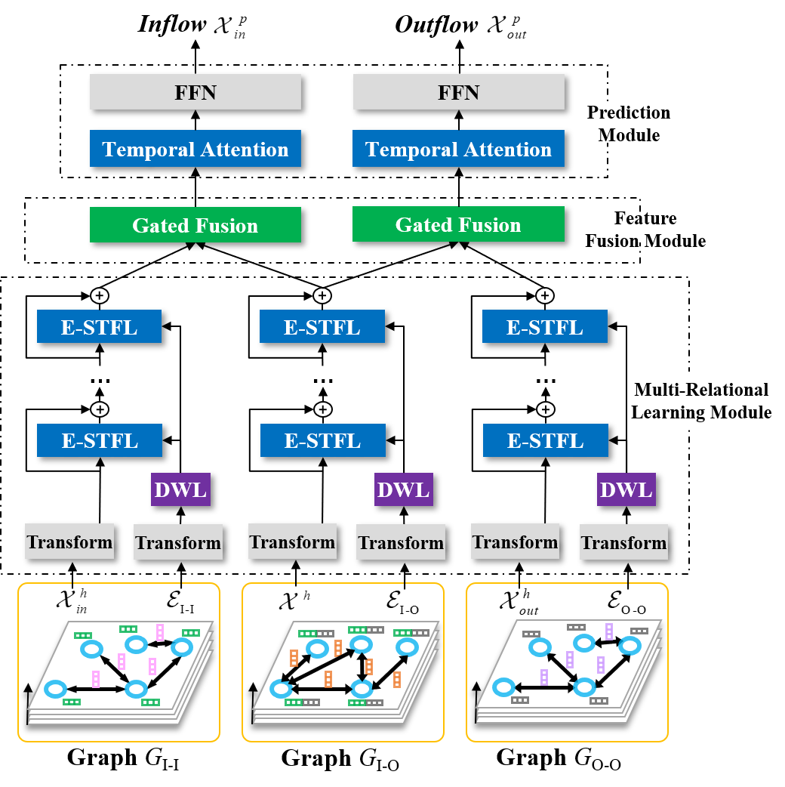

# MRSTN #
This is an implementation of [Traffic Inflow and Outflow Forecasting by Modeling Intra- and Inter-Relationship Between Flows (TITS, 2022)](https://ieeexplore.ieee.org/abstract/document/9827999/). MR-STN is a novel deep spatio-temporal network framework for traffic inflows and outflows forecasting. We show the generality and superiority of MR-STN by implementing it with four state-of-the-art graph-based deep spatio-temporal models, including STGCN, ASTGCN, STMGCN, and STSGCN.

<div  align="center">    

</div>

## Requirements
- mxnet>=1.5.0
- easydict

Use ```nvcc -V``` to check the cuda version and install mxnet with the corresponding version. For example, use ```pip install mxnet-cu101``` to install mxnet for cuda version 10.1.

## Data
Please download the [data](https://pan.baidu.com/s/15mF4Bv67oeN_zHogtKK4Dg?pwd=m876) and unzip it in the ```./dataset``` directory.

## Usage
- python main.py --rid=1 --mode=stgcn --stack=3 --ed=4  --data=Metro
- python main.py --rid=1 --mode=astgcn --stack=3 --ed=4  --data=Metro
- python main.py --rid=1 --mode=stmgcn --stack=3 --ed=4  --data=Metro
- python main.py --rid=1 --mode=stsgcn --stack=3 --ed=4  --data=Metro

## Citing
If our paper benefits to your research, please cite our paper using the bitex below:

    @article{MRSTN,
        title={Traffic Inflow and Outflow Forecasting by Modeling Intra- and Inter-Relationship Between Flows},
        author={Zhao, Yiji and Lin, Youfang and Zhang, Yongkai and Wen, Haomin and Liu, Yunxiao and Wu, Hao and Wu, Zhihao and Zhang, Shuaichao and Wan, Huaiyu},
        journal={IEEE Transactions on Intelligent Transportation Systems},
        volume={23},
        number={11},
        pages={20202--20216},
        year={2022},
        publisher={IEEE}
    }
